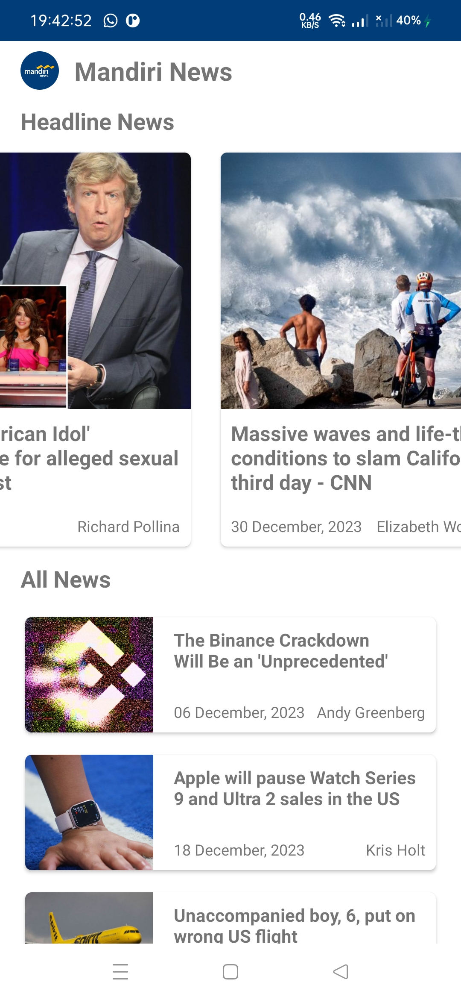

    <h1>Mandiri News</h1>
    
An Android app for showing news

---

  
  
  

## Features
- Headline News
- All News
- Read News

## Data Source
Mandiri News using the [NewsAPI](https://newsapi.org/) for constructing RESTful API. 
NewsAPI provides a RESTful API interface to highly detailed objects built from thousands of lines of data related to news.